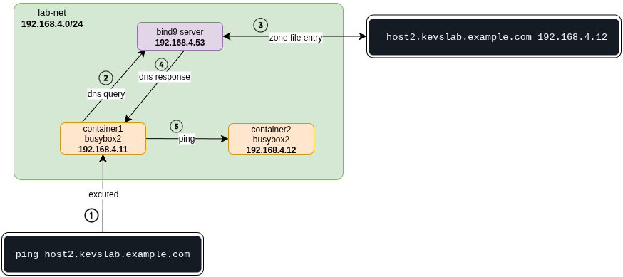

# dnsXplore
explore and trying out various dns concepts n setups

## dns server in docker

1. build the custom docker image to have both bind and nslookup
```
docker build -t bind9-nslookup ./bind9image
```

2. run the docker image
```
docker run -d -it  --name bind9-container \
--mount src="$(pwd)/bind9conf",target=/etc/bind,type=bind \
--mount src="$(pwd)/resolv.conf",target=/etc/resolv.conf,type=bind \
bind9-nslookup
```

3. we exec into the container and perform nslookup
```
docker exec -it bind9-container /bin/sh

# in the container 
nslookup host1.kevslab.example.com
```

## dns server with 2 dummy containers in a different network

> **NOTE** ensure you change the IP address to not conflict with current existing ranges on your system



```sh
# to setup the above config run
docker-compose up
```

## TODO 
- [ ] add reverse records